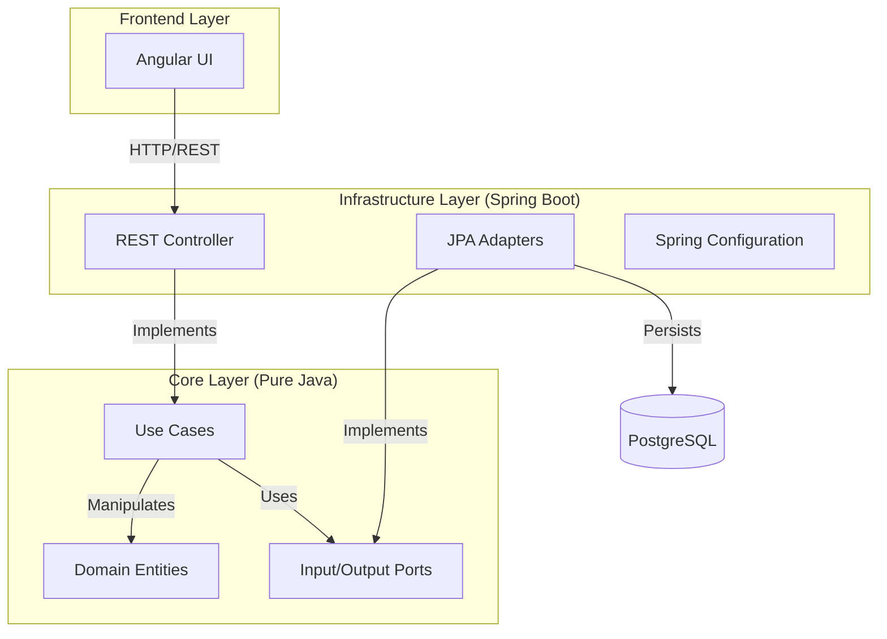

# 🏗️ Bip Teste Integrado - Enterprise Refactored

Solução Fullstack (Java + Angular) refatorada com **Clean Architecture** pura, pronta para produção e containerizada.

## 🏛️ Nova Arquitetura Enterprise

Este projeto foi reestruturado seguindo princípios estritos de Clean Architecture, separação de responsabilidades e padrões sênior.



### Módulos

1.  **`core`**: O "Santuário". Contém apenas regras de negócio puras (Java 17). **Zero Frameworks**.
    *   *Domain*: Entidades ricas (`Beneficio`).
    *   *Application*: Portas (`RepositoryPort`) e Casos de Uso (`TransferenciaUseCase`).
2.  **`infrastructure`**: O "Mundo Real". Spring Boot 3, JPA, Docker.
    *   *Web*: Controllers REST e DTOs.
    *   *Persistence*: Entidades JPA e Repositórios Spring Data.
    *   *Config*: Injeção de dependência dos UseCases.
3.  **`frontend`**: Interface Angular com Material Design.

---

## 🚀 Como Executar (Docker Compose)

A maneira mais fácil de rodar a solução completa (Banco, Backend, Frontend).

### Pré-requisitos
*   Docker & Docker Compose instalados.

### Passos
1.  Na raiz do projeto, execute:
    ```bash
    docker-compose up --build
    ```
2.  Aguarde os containers subirem.
3.  Acesse:
    *   **Frontend**: http://localhost:80
    *   **Backend API**: http://localhost:8080/api/beneficios
    *   **Swagger UI**: http://localhost:8080/swagger-ui.html

---

## 🛠️ Como Executar (Desenvolvimento Local)

Se preferir rodar os serviços individualmente.

### Pré-requisitos
*   Java 17 (JDK)
*   Maven 3.8+
*   Node.js 18+

### 1. Build do Backend (Reactor)
```bash
# Na raiz do projeto
mvn clean install
```

### 2. Rodar a Infraestrutura (Spring Boot)
O backend usa H2 (em memória) por padrão se não houver variáveis de ambiente PostgreSQL configuradas.

```bash
cd infrastructure
mvn spring-boot:run
```
*   API: http://localhost:8080

### 3. Rodar o Frontend (Angular)
```bash
cd frontend
npm install
npm start
```
*   UI: http://localhost:4200

---

## 🧪 Testes

### Unitários (Domain)
```bash
cd core
mvn test
```

### Integração (Infrastructure)
```bash
cd infrastructure
mvn test
```

### Frontend
```bash
cd frontend
npm test
```
